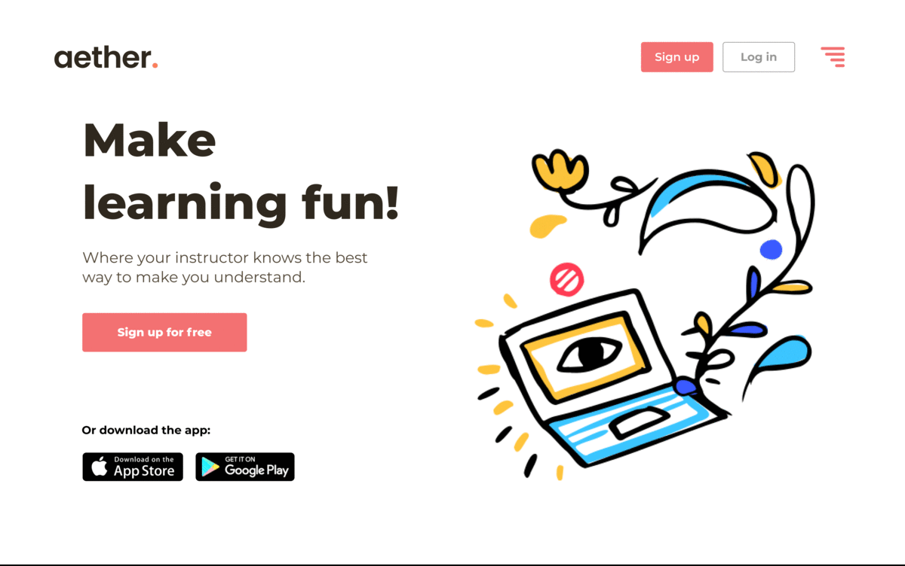

# Aether - Web client 

# Table of Contents
- Choose Javascript runtime
  <!-- - [install Bun.js](#install-bunjs) -->
  - [Using Node.js](#using-nodejs)

<!-- # install-bunjs enviroment

## install bun.js
```bash
  curl -fsSL https://bun.sh/install | bash
```
For more information on Bun.js, please visit the [Bun.js](https://bun.sh) website or github repo [Bun.js](https://github.com/oven-sh/bun#install)

## Install dependencies
```bash
  bun install
```
## Run the app
```bash
  bun run dev
``` -->

# install-nodejs enviroment

## install node version manager
```bash
  curl -o- https://raw.githubusercontent.com/nvm-sh/nvm/v0.35.3/install.sh | bash
```
For more information on nvm, please visit the [nvm](https://github.com/nvm-sh/nvm)

## install nodejs
```bash
  nvm install --lts
```

## install yarn
```bash
  npm install -g yarn
```

## Install dependencies
```bash
  yarn
```

## Run the app
```bash
  yarn run dev
```

## Down the Road
- `JWT` token based authentication
- Student & Teacher different Dashboard
- Teacher can create multiple courses
- Teacher can upload slides and course materials
- Student can enrolled in multiple courses
- Based on students study time and slide data, teacher can ovserve each courses
- Based on data system will suggest teacher for maiking changes in materials
- `System will inform teacher which topic student couldn't understand` by using `eye tracing` data
- Student can drop course/s.
- Teacher can archive course after a certain time. 

## Roadmap
- Assignment delivery system.
- Exam proctoring.
- Appoinment system.
- Assignments and Exam Reminder.
- Video conferencing system 

## Policy
- Camera permission will use only at material reading time.
- No IMAGEs or CLIPs will be stored in any formats inside user's machine or outside any server while student reading course materials.
- Only reading time and eye positioning data will be stored at server.

## Demo
 